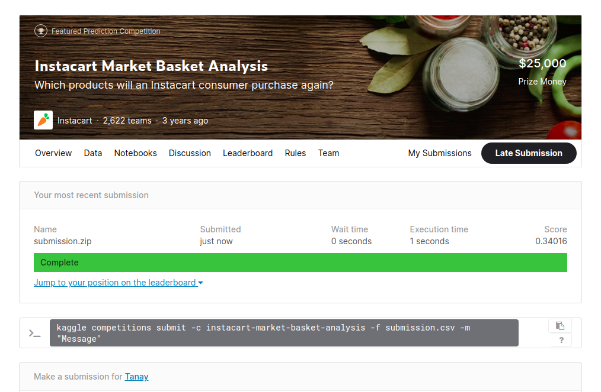

# Instacart-Market-Basket-Analysis

My solution for the Instacart Market Basket Analysis competition on Kaggle.

## Problem Statement 
Given anonymized data on customer orders over time, predict which previously purchased products will be in a user’s next order.

## Dataset
The dataeset contains a sample of over 3 million grocery orders from more than 200,000 Instacart users. For each user, between 4 and 100 of their orders are provided.
To download the dataset (https://www.kaggle.com/c/instacart-market-basket-analysis/data)

## Solution Apporach:
I have created features related USER X ITEM recenet reorder and User total orders and total reorders. This three features was enough to put me into top 300 rank 
and I acheived Mean F1-Score 0.34016

EDA Notebook : tanaykale8390@gmail.com_EDA_CS1.ipynb

Final Features and Final Model Notebook : tanaykale8390@gmail.com_CS1_FE_FINAL_MODEL.ipynb

I have created one test pipline:tanaykale8390@gmail.com_CS1_PIP.ipynb

This file will return Mean F1 Score for given order_id for test data. I have created test data with it's actual reorder products and then I used pretrained model to predict the reorder products for given order and then printed the Mean F1-Score.

## Kaggle score : 

